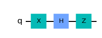
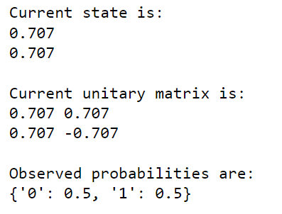
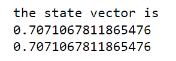
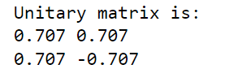

## Name
Quantum Simulator

## Description
- Its a Quantum simulator which can apply single and 2 qubit gates 
- It is made completely from scratch i.e it does not make use of any Quantum library or numpy

## Visuals
for circuit: 

my simulator:

IBM simulator:

## Usage
The class is QuantumProgram(no_of_qubits) which takes only one parameter i.e. number of qubits

the gates that can be applied on it with their corresponding syntax and parametre are:
1. Single qubit gates
    1. h gate: .h(qubit_index)
    2. x gate: .x(qubit_index)
    3. z gate: .z(qubit_index)
    4. rotation gate: .rotate(angle in radians, qubit_index)
2. Two Qubit gates:
    1. cx gate: .cx(control,target)
    2. cz gate: .cz(control, target)
    3. cr gate: .cr(angle in radians, control, target)
3. Three Qubit gate:
    1. ccx gate: .ccx(control1, control2, target)

For simulating circuit you can use the following methods:
1. read_unitary()= Return a single unitary matrix (quantum operator) equivalant to all defined quantum operators until this point, i.e., the multiplication of all quantum operators in the defined order.
2. read_state: Return the current quantum state of circuit.
3. observing_probabilities(): Return the probabilisties of observing the basis states if all qubits are measured at this moment.
4. execute(the_number_of_shots): Return the observed outcomes with their frequencies.

## Support
You can contact on siafirst12@gmail.com

## Authors and acknowledgment
I would like to extend my gratitude to QWorld Instructors

## License
Apache License 2.0

## Project status
Completed

